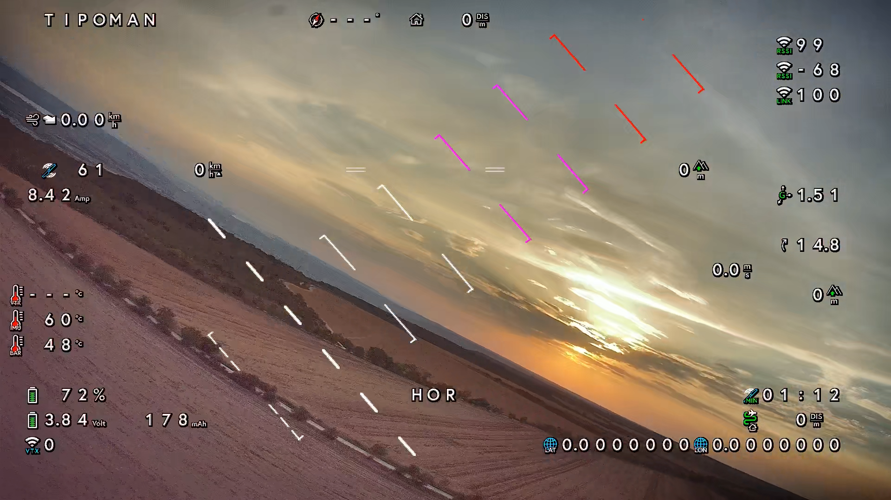

 # MSPOSD
## A tool for drawing betaflight/inav/ardupilot MSP Display Port OSD over OpenIPC video stream.

**Click the image below to watch a video sample:**
[](https://www.youtube.com/watch?v=4907k5c7b4U)

```
Usage: msposd [OPTIONS]
 -m --master      Serial port to receive MSP (%s by default)\n"
 -b --baudrate    Serial port baudrate (%d by default)\n"
 -o --output	  UDP endpoint to forward aggregated MSP messages
 -c --channels    RC Channel to listen for commands (0 by default) and exec channels.sh\n"
 -w --wait        Delay after each command received(2000ms default)\n"
 -r --fps         Max MSP Display refresh rate(5..50)\n"
 -p --persist     How long a channel value must persist to generate a command - for multiposition switches (0ms default)\n"
 -t --temp        Read SoC temperature\n"
 -d --wfb         Monitors wfb.log file and reports errors via HUD messages\n"
 -s --osd         Parse MSP and draw OSD over the video"
 -a --ahi         Draw graphic AHI, mode [0-No, 2-Simple 1-Ladder, 3-LadderEx]"
 -v --verbose     Show debug infot\n"	       
 --help           Display this help\n"
```

### Additional options.
Forwarding of MSP packets via UDP.  
Can monitor RC Channels values in FC and call the script `channels.sh` (located at /usr/bin or /usr/sbin).Will passing the channel number and its value to it as $1 and $2 parameters. This allows for controlling the camera via the Remote Control Transmitter.  
AHI (Artificial Horizon Indicator) ladder - Graphical AHI , that is drawn over the standard OSD.  

This project is based on these exceptional repos https://github.com/fpv-wtf/msp-osd and https://github.com/OpenIPC/osd

## Example :

```
msposd  --master /dev/ttyS2 --baudrate 115200 --channels 7 --out 127.0.0.1:14555 -osd -r 20 --ahi 1 -v
```
Read on  UART2 with baudrade 115200 and listen for value changes of RC channel 7 that come from the Remote Control via Flight Controller.
Every time the value is changed with more than 5% the bash script ```channels.sh {Channel} {Value}``` will be started with params provided.
Forward MSP to UDP port 14555 so that it can be handled by wfb-ng and send to the ground.  
Draw Artificial Horizon Indicator Ladder, with colour coded vertical steps.  
Refresh rate of the OSD is limited to 20, this depends on the FC and MSP DisplayPort implementation, usually it is between 12 to 17.  

Font files for every Flight control firmwares have two versions - for 720p and for 1080p resolutions. They should be named font_hd.png and font.png respectively and saved in /usr/bin folder on the cam
They are different for every FC, choose the appropriate pair.
The program will read /etc/majestic.yaml and will choose the type of font that will be used based on the video resolution configured there.

## To install:
Copy msposd for the architecture you need on the cam.  
Prebuild binaries for x86 and SigmaStar are at release/ folder.  
```
curl -o /usr/bin/msposd https://github.com/tipoman9/msposd/tree/MSP_OSD/release/star6e/msposd
chmod 755 /usr/bin/msposd
```
Don't forget to copy the font files for you flight controller firmware!
for INAV these would be
```
curl -O https://github.com/tipoman9/msposd/tree/MSP_OSD/fonts/inav/font_hd.png
curl -O https://github.com/tipoman9/msposd/tree/MSP_OSD/fonts/inav/font.png
```
Start msposd or reference it in OpenIPC scripts.  
Additional fonts can be downloaded from here: https://sites.google.com/view/sneaky-fpv/home 

